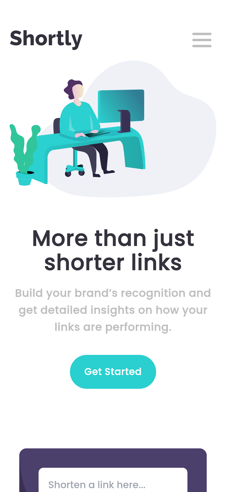

# Frontend Mentor - Shortly URL shortening API Challenge solution

This is a solution to the [Shortly URL shortening API Challenge challenge on Frontend Mentor](https://www.frontendmentor.io/challenges/url-shortening-api-landing-page-2ce3ob-G). Frontend Mentor challenges help you improve your coding skills by building realistic projects.

## Table of contents

- [Overview](#overview)
  - [The challenge](#the-challenge)
  - [Screenshot](#screenshot)
  - [Links](#links)
- [My process](#my-process)
  - [Built with](#built-with)
  - [What I learned](#what-i-learned)
  - [Continued development](#continued-development)
  - [Useful resources](#useful-resources)
- [Author](#author)


## Overview

### The challenge

Users should be able to:

- View the optimal layout for the site depending on their device's screen size
- Shorten any valid URL
- See a list of their shortened links, even after refreshing the browser
- Copy the shortened link to their clipboard in a single click
- Receive an error message when the `form` is submitted if:
  - The `input` field is empty

### Screenshot
### Desktop View


### Mobile View


### Links

- Solution URL: [Github](https://github.com/codinci/url-shortening-api)
- Live Site URL: [Add live site URL here](https://your-live-site-url.com)

## My process

### Built with

- [React](https://reactjs.org/) - JS library using vite
- [TypeScript](https://www.typescriptlang.org/) - JS with syntax for types
- [Zustand](https://docs.pmnd.rs/zustand/getting-started/introduction) - State management library
- [Axios](https://axios-http.com/docs/intro) - Http requests
- [Bitly](https://app.bitly.com) -Api for shortening url links
- [Tailwind Css](https://tailwindcss.com/) - For styles


### What I learned
- Learnt on use of tailwind css for a mobile webflow design
```Info.tsx
    <div
      className='flex flex-col items-center md:mt-12 bg-white rounded-lg w-full
      h-fit md:w-1/3 md:items-start lg:w-1/4'
    >
```
- Setting customizations to tailwind css utilities
```tailwind.config.js
/** @type {import('tailwindcss').Config} */
export default {
  content: [
    "./index.html",
    "./src/**/*.{js,ts,jsx,tsx}",
  ],
  theme: {
    fontFamily: {
      'poppins': 'Poppins, Helvetica, Arial, sans-serif',
    },

    screens: {
      sm: '415px',
      md: '768px',
      lg: '976px',
      xl: '1440px',
    },
    extend: {
      colors: {
        'primary-cyan': 'hsl(var(--color-primary-cyan))',
        'primary-dark-violet': 'hsl(var(--color-primary-dark-violet))',
        'secondary-red': 'hsl(var(--color-secondary-red))',
        'neutral-gray': 'hsl(var(--color-neutral-gray))',
        'neutral-gray-violet': 'hsl(var(--color-neutral-grayish-violet))',
        'neutral-very-dark-blue': 'hsl(var(--color-neutral-very-dark-blue))',
        'neutral-very-dark-violet': 'hsl(var(--color-neutral-very-dark-violet))',
      },

      fontSize: {
        base: ['18px', '24px'],
      },

      backgroundImage: {
        'desktop-shorten-image': "url(../../images/bg-shorten-desktop.svg)",
        'desktop-boost-image': "url(../../images/bg-boost-desktop.svg)",
        'mobile-shorten-image': "url(../../images/bg-shorten-mobile.svg)",
        'mobile-boost-image': "url(../../images/bg-boost-mobile.svg)",
      }
    },
  },
  plugins: [],
}
```
- Learnt on typescript and on defining interfaces for use
```LinkForm.tsx
  export interface LinkObject {
    url: string;
    shortUrl: string;
    timeStamp: number;
  }
```
- Learnt on use of zustand for state management and global access of state
```store.jsx
  import { create } from "zustand";
  import { LinkObject } from "./components/LinkForm";

  interface NavState {
    isOpen: boolean;
    displayLink: boolean;
    linkObjects: LinkObject[];
    toggleIsOpen: () => void;
    setDisplayLink: () => void;
    resetDisplayLink: () => void;
    setLinkObj: (newLinks: LinkObject[]) => LinkObject[];
  }

  const getStoredLinks = () => {
    const storedLinkObjectsString = localStorage.getItem("shortenedUrls");
    const storedLinkObjects = storedLinkObjectsString ? JSON.parse(storedLinkObjectsString) : [];
    return storedLinkObjects;
  }

  export const useNavStore = create<NavState>((set) => {
    return {
      isOpen: false,
      displayLink: false,
      linkObjects: getStoredLinks(),
      toggleIsOpen: () => set((state) => ({ isOpen: !state.isOpen })),
      setDisplayLink: () => set(() => ({ displayLink: true })),
      resetDisplayLink: () => set(() => ({ displayLink: false })),
      setLinkObj: (newLinks) => {
        set((state) => {
          const updatedLinkObjects = [...state.linkObjects, ...newLinks];
          localStorage.setItem("shortenedUrls", JSON.stringify(updatedLinkObjects));

          // Update the linkObjects in the store
          return { linkObjects: updatedLinkObjects };
        });


        return newLinks;
      },
    };
  });
```

### Continued development

I'd like to further develop this application and make my own backend to shorten the urls in future.

### Useful resources

- [Medium](https://medium.com/@1992season/manage-states-using-zustand-and-localstorage-7d66ff12cad6) - This helped me gain insight on how to set the initial linkObjects to the array stored in localStorage on mount
- [Dev Community](https://dev.to/noruwa/animated-hamburger-menu-with-tailwindcss-1j0b) - This article enabled me to animate my mobile navbar hamburger menu.

## Author

- Frontend Mentor - [codinci](https://www.frontendmentor.io/profile/codinci)
- Github - [codinci](https://github.com/codinci)

